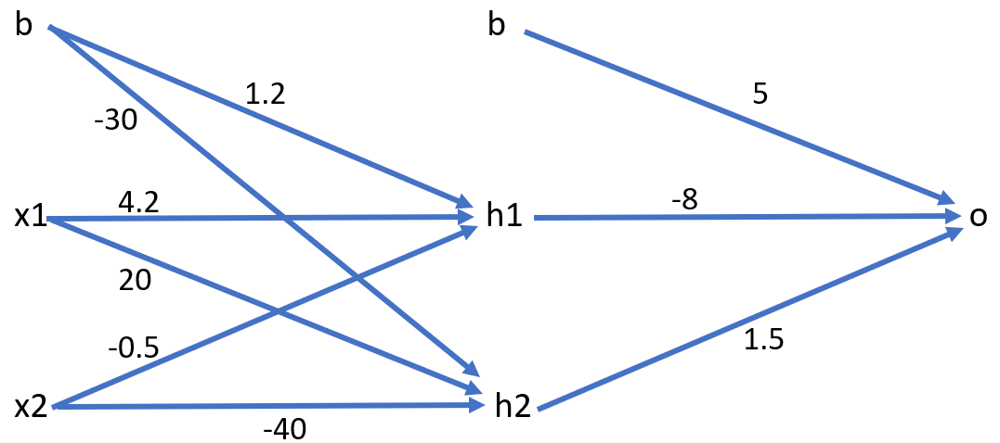

#Problem 1:

##(a). 



##(b). 

Since: 

$tanh(x) = \frac{sinh(x)}{coosh(x)} = \frac{e^x-e^{-x}}{e^x+e^{-x}} = \frac{e^{2x}-1}{e^{2x}+1}$


Then:

$h_{1} = tanh(\beta_{1,0}\times 1 + \sum_{j=1}^{2}\beta_{1,j}\times x_{j}) = tanh(1.2+4.2x_{1}-0.5x_{2})= \frac{e^{2(1.2+4.2x_{1}-0.5x_{2})}-1}{e^{2(1.2+4.2x_{1}-0.5x_{2})}+1}$


##(c). 

$tanh(x) = \frac{e^{2x}-1}{e^{2x}+1}$

$$
z= g(h_{1}, h_{2})=tanh(w_{0}\times 1 + \sum_{i = 1}^{2}w_{i}\times h_{i})= tanh(5 -8h_{1} + 1.5h_{2})=\frac{e^{2(5 -8h_{1} + 1.5h_{2})}-1}{e^{2(5 -8h_{1} + 1.5h_{2})}+1}
$$

##(d). 

Since $z = \frac{e^{2A}-1}{e^{2A}+1}$ while $A = 5 -8h_{1} + 1.5h_{2}$.

$h_{1}= \frac{e^{2B}-1}{e^{2B}+1}$ while $B = 1.2+4.2x_{1}-0.5x_{2}$.

$h_{2}= \frac{e^{2C}-1}{e^{2C}+1}$ while $C = -30 +20x_{1}-40x_{2}$.

We plug $h_{1}, h_{2}$ into $z$ we get that: 

$$
z= \frac{e^{2(5 -8h_{1} + 1.5h_{2})}-1}{e^{2(5 -8h_{1} + 1.5h_{2})}+1}
= \frac{e^{2(5 -8(\frac{e^{2(1.2+4.2x_{1}-0.5x_{2})}-1}{e^{2(1.2+4.2x_{1}-0.5x_{2})}+1}) + 1.5(\frac{e^{2(-30 +20x_{1}-40x_{2})}-1}{e^{2(-30 +20x_{1}-40x_{2})}+1}))}-1}{e^{2(5 -8(\frac{e^{2(1.2+4.2x_{1}-0.5x_{2})}-1}{e^{2(1.2+4.2x_{1}-0.5x_{2})}+1}) + 1.5(\frac{e^{2(-30+20x_{1}-40x_{2})}-1}{e^{2(-30 +20x_{1}-40x_{2})}+1}))}+1}
$$

#Problem 2.


Since $tanh(x)$ is symmetric to $(0,0)$, we can derive that $tanh(ax) = -tanh(-ax)$ given any constant $a$. 

In the original neural network has the equation: $z = tanh(-5 + 4tanh(5x_{1})+6tanh(7x_{2}))$. 

By the above symmetric property of $tanh(x)$ and the Commutative Property of addition$( a + b = b + a)$:

$$
\begin {aligned}
z&=tanh(-5 + 4tanh(5x_{1})+6tanh(7x_{2})) \Rightarrow\ Original\ nnet\ function\\\
&=tanh(-5 + 6tanh(7x_{1})+4tanh(5x_{2})) \Rightarrow\ variation(1)\\\
&=tanh(-5 - 6tanh(-7x_{1})+4tanh(5x_{2})) \Rightarrow\ variation(2)\\\
&=tanh(-5 -6 tanh(-7x_{1})-4tanh(-5x_{2})) \Rightarrow\ variation(3)\\\
&=tanh(-5 + 6tanh(7x_{1})-4tanh(-5x_{2})) \Rightarrow\ variation(4)\\\
&=tanh(-5 + 4tanh(5x_{1})-6tanh(-7x_{2})) \Rightarrow\ variation(5)\\\
&=tanh(-5 - 4tanh(-5x_{1})+6tanh(7x_{2})) \Rightarrow\ variation(6)\\\
&=tanh(-5 - 4tanh(-5x_{1})-6tanh(-7x_{2})) \Rightarrow\ variation(7)
\end {aligned}
$$

There are 7 variations where different weight matrices can generate the same neural network as in the original weight matrix. The following is the 7 different variations result in the same nnet outcome. The columns are the hidden nodes, the rows are different input values, and the entries of the matrices are the weights: 

variation (1):

```{r}
matrix(c(0,0,7,0,5,0,-5,6,4),nrow = 3) 
```

variation (2):

```{r}
matrix(c(0,0,-7,0,5,0,-5,-6,4),nrow = 3) 
```

variation (3):

```{r}
matrix(c(0,0,-7,0,-5,0,-5,-6,-4),nrow = 3) 
```

variation (4):

```{r}
matrix(c(0,0,7,0,-5,0,-5,6,-4),nrow = 3) 
```

variation (5):

```{r}
matrix(c(0,-5,0,0,0,-7,-5,4,-6),nrow = 3) 
```

variation (6):

```{r}
matrix(c(0,-5,0,0,0,7,-5,-4,6),nrow = 3) 
```

variation (7):

```{r}
matrix(c(0,-5,0,0,0,-7,-5,-4,-6),nrow = 3) 
```


#Problem 3


##(a). 

```{r}
library(nnet)
set.seed(1234)
Advertising <- read.csv("Advertising.csv")

lm1 <- lm(Sales~Newspaper+Radio+TV,data = Advertising) 
nnet1 <- nnet(Sales~Newspaper+Radio+TV,data = Advertising, skip=T,linout=T,size=0)

```

```{r}
summary(lm1)
```

```{r}
summary(nnet1)
```

The linear model fitted from the linear regression: 

$sales = 2.938889 -0.001037Newspaper +  0.188530Radio + 0.045765TV$

The neural network model fitted from nnet:

$sales = 2.94 + 0.00 Newspaper +  0.19Radio + 0.05TV$

These two equations are almost the same so the two fitting models generates the same result.    

```{r}
sum(lm1$residuals^2)
```

```{r}
sum(nnet1$residuals^2)
```


They have exactly the same SSE. 


##(b). 

```{r}
ad2=data.frame(scale(Advertising)) 
head(ad2)
ad2$Sales=Advertising$Sales
```

The scale function scale the columns in the original dataframe into standard normal distribution. It turns the values in each feature into feature-specific z-score.
1
##(c). 

```{r}
lm2 <- lm(Sales ~ Newspaper + Radio + TV, data=ad2) 
summary(lm2)
```

$sales = 14.0225 - 0.0226Newspaper +  2.7991Radio + 3.9291TV$


In the original function, the objective is to minimize the $SSE = ||Y - \beta X||_{2}^{2}$.

If we rescale the feature, the following the procedure will occur: 

The objective will turn into: 

$$

\begin {aligned}
sales&=\beta_{0}^{'} + \beta_{1}^{'}\frac{Newspaper - mean_{Newspaper}}{sd_{Newspaper}} + \beta_{2}^{'}\frac{Radio - mean_{Radio}}{sd_{Radio}} + \beta_{3}^{'}\frac{TV - mean_{TV}}{sd_{TV}} \\\
&=(\beta_{0}^{'}+\sum_{sd_{i=Newspaper, Radio, TV}}\frac{-mean_{i}}{sd_{i}}) + (\beta_{1}^{'}\frac{1}{sd_{Newspaper}})Newspaper  + (\beta_{2}^{'}\frac{1}{sd_{Radio}})Radio + (\beta_{3}^{'}\frac{1}{sd_{TV}})TV\\\
&=\beta_{0}^{''} + \beta_{1}^{''}Newspaper + \beta_{3}^{''}Radio +\beta_{3}^{''}TV
\end {aligned}

$$

This has the same form of the original funciton. The resulting linear regression coefficients will be different than that of the original function. 


#Problem 4. 


##(a). 

```{r}
load("mnist_all.RData")

train_df = data.frame(train$x)
test_df = data.frame(test$x)

train_df$class = train$y
test_df$class = test$y

table(train_df$class)
```


```{r}
train_47 <- subset(train_df , class == 4 | class == 7)
train_47$class[train_47$class == 4] <- 0
train_47$class[train_47$class == 7] <- 1
table(train_47$class)


test_47 = subset(test_df , class == 4 | class == 7)
test_47$class[test_47$class == 4] <- 0
test_47$class[test_47$class == 7] <- 1
table(test_47$class)
```


```{r}
cor(train_47$X400,train_47$X300)
var(train_47$X400)
var(train_47$X300) 
```

X400 and X300 has large variance and low correlation, so they can be used for training. 

AUC for training data:

```{r}
library(pROC)
glm1 <- glm(class~X400+X300,data = train_47, family = "binomial")
pred1 <- predict(glm1,train_47,type='response') 
auc(train_47$class,pred1)
```

AUC for test data:

```{r}
library(pROC)
glm1 <- glm(class~X400+X300,data = train_47, family = "binomial")
pred1 <- predict(glm1,train_47,type='response') 
auc(train_47$class,pred1)
```

AUC for test data:

```{r}
pred2 <- predict(glm1,test_47,type='response') 
auc(test_47$class,pred2)
```

We can see that for training set the area under the curve is almost 0.8 and it is about the same for test data. So our model is farely good. 


##(b).

AUC for training data:

```{r}
library(nnet)
nnet2 <- nnet(class~X400+X300, data = train_47, size = 1, decay=0.1)
pred3 <- as.vector(predict(nnet2,train_47,type = 'raw'))
auc(train_47$class,pred3)
``` 

AUC for test data:

```{r}
pred4 <- as.vector(predict(nnet2,test_47,type = 'raw'))
auc(test_47$class,pred4)
```

When using neural network to fit the data, the auc are relatively the same(stick around 0.8). The fitting performance of logistic regresson highly depend on the number of nodes in a layer, decay and the seed. In this example, the combination of these factors in the neural network works equivalently compare to the logistic regression.


##(c). 

```{r}
set.seed(2018)
nnet3 <- nnet(class~X400+X300, data = train_47, size = 2, decay=0.1)
nnet4 <- nnet(class~X400+X300, data = train_47, size = 3, decay=0.1)
nnet5 <- nnet(class~X400+X300, data = train_47, size = 4, decay=0.1)
```

```{r}
pred5 <- as.vector(predict(nnet3,train_47,type = 'raw'))
auc(train_47$class,pred5)
pred6 <- as.vector(predict(nnet3,test_47,type = 'raw'))
auc(test_47$class,pred6)
```


```{r}
pred7 <- as.vector(predict(nnet4,train_47,type = 'raw'))
auc(train_47$class,pred7)
pred8 <- as.vector(predict(nnet4,test_47,type = 'raw'))
auc(test_47$class,pred8)
```


```{r}
pred9 <- as.vector(predict(nnet5, train_47,type = 'raw'))
auc(train_47$class, pred9)
pred10 <- as.vector(predict(nnet5, test_47,type = 'raw'))
auc(test_47$class, pred10) 
```


We can see that for both the training set and test set, the AUC are relatively the same when using three different sizes of neural networks and the fact that the AUC for three test sets did not increase is a mild evidence of overfitting. Since the training AUC did not increase, which will always happen when we increase the complexity of the network, we could also suspect that the "step" of increasing the size of the network is too small for the data to show any significant increase in training(as well the testing) AUC score.


