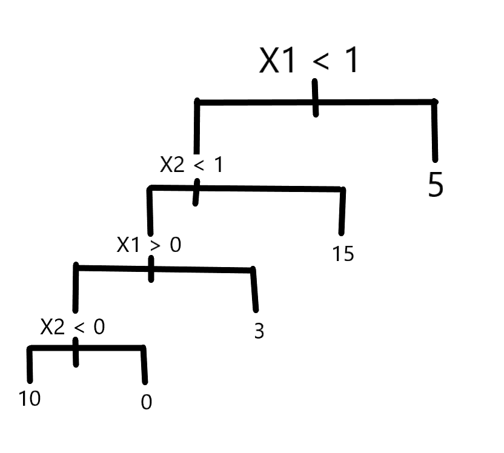

#8.4.1. Draw an example (of your own invention) of a partition of twodimensional feature space that could result from recursive binary splitting. Your example should contain at least six regions. Draw a decision tree corresponding to this partition. Be sure to label all aspects of your figures, including the regions R1,R2, . . ., the cutpoints t1, t2, . . ., and so forth.

```{r}
par(xpd = NA)
plot(NA, NA, type = "n", xlim = c(0,100), ylim = c(0,100), xlab = "X", ylab = "Y")
lines(x = c(50,50), y = c(0,100))
text(x = 50, y = 108, labels = c("t1"), col = "red")
lines(x = c(0,50), y = c(75,75))
text(x = -8, y = 75, labels = c("t2"), col = "red")
lines(x = c(75,75), y = c(0,100))
text(x = 75, y = 108, labels = c("t3"), col = "red")
lines(x = c(25,25), y = c(0,75))
text(x = 25, y = 80, labels = c("t4"), col = "red")
lines(x = c(75,100), y = c(25,25))
text(x = 70, y = 25, labels = c("t5"), col = "red")

text(x = (50+75)/2, y = 50, labels = c("R1"))
text(x = 25, y = (100+75)/2, labels = c("R2"))
text(x = (75+100)/2, y = (100+25)/2, labels = c("R3"))
text(x = (75+100)/2, y = 25/2, labels = c("R4"))
text(x = 35, y = 75/2, labels = c("R5"))
text(x = 15, y = 75/2, labels = c("R6"))
```


#8.4.4.This question relates to the plots in Figure 8.12.

##(a). Sketch the tree corresponding to the partition of the predictor space illustrated in the left-hand panel of Figure 8.12. The numbers inside the boxes indicate the mean of Y within each region.




##(b).Create a diagram similar to the left-hand panel of Figure 8.12, using the tree illustrated in the right-hand panel of the same figure. You should divide up the predictor space into the correct regions, and indicate the mean for each region.

```{r}
par(xpd = NA)
plot(NA, NA, type = "n", xlim = c(-2, 2), ylim = c(-3, 3), xlab = "X1", ylab = "X2")
lines(x = c(-2, 2), y = c(1, 1))
lines(x = c(1, 1), y = c(-3, 1))
text(x = (-2 + 1)/2, y = -1, labels = c(-1.8))
text(x = 1.5, y = -1, labels = c(0.63))
lines(x = c(-2, 2), y = c(2, 2))
text(x = 0, y = 2.5, labels = c(2.49))
lines(x = c(0, 0), y = c(1, 2))
text(x = -1, y = 1.5, labels = c(-1.06))
text(x = 1, y = 1.5, labels = c(0.21))
```


#8.4.9. (omit c)

##(a).Create a training set containing a random sample of 800 observations, and a test set containing the remaining observations.

```{r}
library(ISLR)
set.seed(1)
train <- sample(1:nrow(OJ), 800)
OJ.train <- OJ[train, ]
OJ.test <- OJ[-train, ]
```

##(b).Fit a tree to the training data, with Purchase as the response and the other variables as predictors. Use the summary() function to produce summary statistics about the tree, and describe the results obtained. What is the training error rate? How many terminal nodes does the tree have?

```{r}
library(tree)
tree.oj <- tree(Purchase ~ ., data = OJ.train)
summary(tree.oj)
```


The fitted tree has a training error rate of 0.165 and 8 terminal nodes.

##(d).Create a plot of the tree, and interpret the results.

```{r}
plot(tree.oj)
text(tree.oj, pretty = 0)
```

we can see that the predictor that could potentially influence the Purchase the most is LoyalCH because the top two layers of the tree contain LoyalCH.

##(e).Predict the response on the test data, and produce a confusion matrix comparing the test labels to the predicted test labels. What is the test error rate?

```{r}
tree.pred <- predict(tree.oj, OJ.test, type = "class")
table(tree.pred, OJ.test$Purchase)
```


The error rate: 

```{r}
unpruned_test_error = 1 - (147 + 62) / 270
unpruned_test_error
```

The error rate is about 0.226. 

##(f).Apply the cv.tree() function to the training set in order to determine the optimal tree size.

```{r}
cv.oj <- cv.tree(tree.oj, FUN = prune.misclass)
cv.oj
```

##(g).Produce a plot with tree size on the x-axis and cross-validated classification error rate on the y-axis.

```{r}
plot(cv.oj$size, cv.oj$dev, type = "b", xlab = "Tree size", ylab = "Deviance")
```


##(h).Which tree size corresponds to the lowest cross-validated classification error rate?

From the plot we can see that the 2-node tree is the smallest tree with the lowest classification error rate.

##(i).Produce a pruned tree corresponding to the optimal tree size obtained using cross-validation. If cross-validation does not lead to selection of a pruned tree, then create a pruned tree with five terminal nodes.

```{r}
prune.oj <- prune.misclass(tree.oj, best = 2)
plot(prune.oj)
text(prune.oj, pretty = 0)
```

##(j).Compare the training error rates between the pruned and unpruned trees. Which is higher?

```{r}
summary(tree.oj)
```


```{r}
summary(prune.oj)
```

The misclassification error rate is slightly higher for the pruned tree.


##(k).Compare the test error rates between the pruned and unpruned trees. Which is higher?

```{r}
pruned.pred <- predict(prune.oj, OJ.test, type = "class")
table(pruned.pred, OJ.test$Purchase)
```


```{r}
pruned_test_error = 1 - (119 + 81) / (119 + 81 + 40 + 30)
pruned_test_error
```

```{r}
unpruned_test_error
```

In this case, the prund tree have a higher test error rate; 26%. But the pruned tree is far more easier to interpret than the unpruned tree.  


#8.4.12. Apply boosting, bagging, and random forests to a data set of your choice. Be sure to fit the models on a training set and to evaluate their performance on a test set. How accurate are the results compared to simple methods like linear or logistic regression? Which of these approaches yields the best performance? Do this with the MNIST_6-8 data we've used previously [8 pts] - use only 2 out of the three Ensemble methods, your choice - no need to use all 784 features, pick a few dozen.


```{r}
load("mnist68.RData")

dim(mnist68)
table(mnist68$labels)
```

Data slicing: 

We choose 90 pixels that has the largest variance for model training. 

```{r}
library(plyr)
var.68 = colwise(var)(mnist68)
var.68.sort = sort(var.68, decreasing = TRUE)
partial_68_cols = colnames(var.68.sort)[1:90]
partial_68 = mnist68[c(partial_68_cols, "labels")]
```


```{r}
dim(partial_68)
table(partial_68$labels)
```

Setting training set and testing set: 

```{r}
set.seed(11)
sample.train = sample(1:dim(partial_68)[1], dim(partial_68)[1] / 2) #Sample all rows, only keep half of them
sample.test = - sample.train

#training set for logistic regression, need labels to be integer(0 or 1).
train68.logistic <-  partial_68[sample.train, ]
test68.logistic <- partial_68[sample.test, ]

#training set for bagging and rf regression, need labels to be factors.
partial_68$labels <- as.factor(partial_68$labels)
train68 <- partial_68[sample.train, ]
test68 <- partial_68[sample.test, ]
```


First we do a simple linear regression for classification:

```{r}
train68.logistic$labels[train68$labels == 6] <- 0
train68.logistic$labels[train68$labels == 8] <- 1


logistic.model.68 <- glm(labels ~., data = train68.logistic, family = binomial)
summary(logistic.model.68)
```

```{r}
prob.logistic <- predict(logistic.model.68, test68.logistic, type='response') 
logistic.pred68 = rep(6, length(test68.logistic$labels))
logistic.pred68[prob.logistic >.5] = 8
table(logistic.pred68, test68.logistic$labels)
```

Test error: 

```{r}
(73 + 108) / (2854 + 2850 + 73 + 108)
```

So the test error using logistic regression for classifying 6 and 8 is about 3.1%.


Bagging:

We choose all of the predictors in the dataset to perform bagging.


```{r}
partial_68$labels <- as.factor(partial_68$labels)


library(randomForest)
set.seed (1)
bag.partial68 = randomForest(labels ~., data = train68, mtry=90, importance =TRUE)
bag.partial68
```

```{r}
bag.pred = predict(bag.partial68, newdata = test68, type = "class")
table(bag.pred, test68$labels)
```

```{r}
bag.test.error = (84 + 57) / (2870 + 2874 + 84 + 57)
bag.test.error
```

The test classification error rate when using bagging is about 2.4%.


Random Forest: 

Choose $\sqrt p = \sqrt 90 \approx 10$ predictors to perform random forest classification. 

```{r}
set.seed(1)
rf.partial68 = randomForest(labels ~., data = train68, mtry = 10, importance =TRUE)
rf.partial68
```

```{r}
rf.pred = predict(rf.partial68, newdata = test68, type = "class")
table(rf.pred, test68$labels)
```


```{r}
rf.test.error = (65 + 55) / (2872 + 2893 + 65 + 55)
rf.test.error
```


The test classification error rate when using random forest is about 2.0%.


We can see that the test result for Random Forest and Bagging(2.4% and 2.0%) are both lower than the test error of a simple logistic regression(3.1%). Since the test error when using Random Forest is 2.0%, we would say that Random Forest yields the best performance. 


